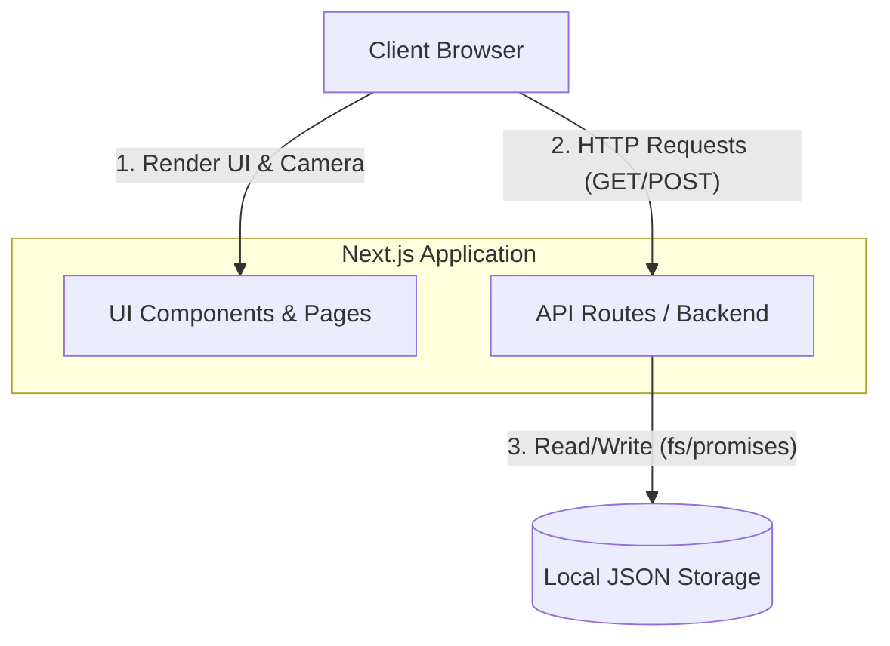
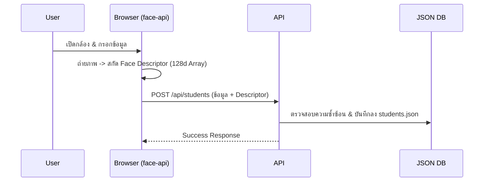
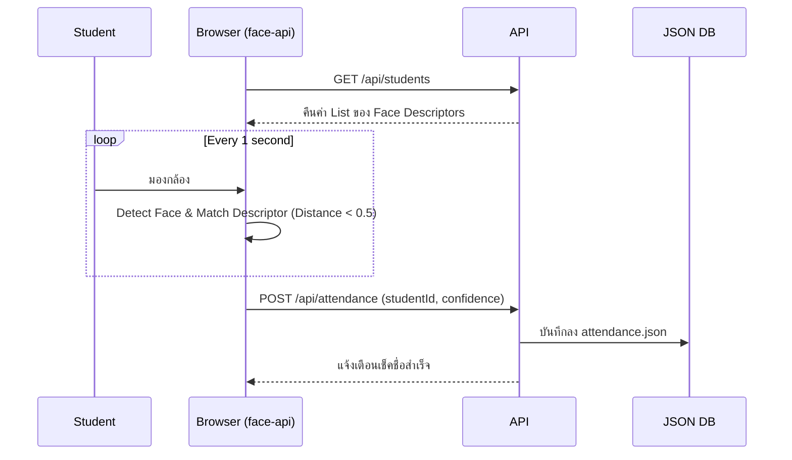

# System Architecture — Smart Attendance System

เอกสารอธิบายสถาปัตยกรรมของระบบ Smart Attendance System ซึ่งถูกออกแบบมาให้เรียบง่ายและสามารถทำงานได้ครบถ้วนภายในตัวเอง (Self-contained) เพื่อจุดประสงค์ในการนำเสนอ (Demonstration)

## 1. High-Level Architecture

ระบบถูกพัฒนาด้วยสถาปัตยกรรม **Client-Server แบบเบา (Lightweight)** โดยใช้ **Next.js (App Router)** เป็นทั้งฝั่ง Client (Frontend) และ Server (API Routes) พร้อมเก็บข้อมูลลงใน Local JSON File

## 2. Core Components

### 2.1 Frontend (Client-side)
- **Framework:** React / Next.js (ใช้ `'use client'` สำหรับหน้าที่ต้องเข้าถึง DOM และ Web API)
- **Styling:** Tailwind CSS (กำหนด Theme ด้วย CSS Variables)
- **AI Processing (`face-api.js`):** 
  - ประมวลผลใบหน้า **ที่ฝั่ง Client (Browser)** เท่านั้น 
  - รีดประสิทธิภาพจาก WebGL และช่วยรักษาความปลอดภัยด้านข้อมูล (PDPA) เพราะไม่ต้องอัปโหลดรูปภาพจริงไปยังเซิร์ฟเวอร์
- **Data Visualization (`recharts`):** แสดงกราฟสรุปผลในหน้า Dashboard

### 2.2 Backend (Next.js API Routes)
ทำหน้าที่เป็นตัวกลาง (Middleware) ระหว่าง Client และ File System
- `/api/students`: ลงทะเบียนและดึงข้อมูลนักศึกษา
- `/api/students/[id]`: แก้ไขหรือลบข้อมูลนักศึกษา (PUT/DELETE)
- `/api/attendance`: บันทึกประวัติการสแกนหน้า
- `/api/dashboard`: สรุปตัวเลขสถิติและคำนวณข้อมูลย้อนหลัง 7 วันเพื่อส่งให้กราฟ
- `/api/reset`: ล้างข้อมูลทั้งหมดเพื่อเตรียมสาธิตใหม่

### 2.3 Application Pages
1. **`app/page.tsx`**: หน้า Home/Landing
2. **`app/register/page.tsx`**: หน้าต่างถ่ายรูปลงทะเบียน (สกัด Face Descriptor)
3. **`app/check-in/page.tsx`**: หน้าต่างสแกนใบหน้าเข้าเรียนแบบ Real-time
4. **`app/dashboard/page.tsx`**: หน้า Dashboard สรุปผลของ Instructor
5. **`app/students/page.tsx`**: หน้าจัดการรายชื่อนักศึกษา (ตรวจสอบ และลบ)
6. **`app/students/[id]/page.tsx`**: หน้าฟอร์มสำหรับแก้ไขข้อมูลนักศึกษา

### 2.4 Data Layer (Local File System)
- ใช้ Node.js `fs/promises` ในการเขียนและอ่านไฟล์ JSON
- จัดการ Concurrency แบบพื้นฐานด้วย Lock Flag (Mutex) ในหน่วยความจำ เพื่อป้องกันการเขียนไฟล์ทับกันในจังหวะที่มี Request เข้ามาพร้อมกัน (แม้จะมีโอกาสน้อยในการเดโม่ก็ตาม)

## 3. Data Flow

### 3.1 Face Enrollment Flow (การลงทะเบียน)

### 3.2 Check-in Flow (การเช็คชื่อ)

## 4. Design Trade-offs (ข้อตกลงในการออกแบบ)
- **No External DB:** ไม่ใช้ฐานข้อมูลภายนอกอย่าง PostgreSQL หรือ MongoDB เพื่อให้รันง่าย ไม่ต้องพึ่งพาอินเทอร์เน็ตในการตั้งค่า
- **Client-Side AI:** ย้ายการประมวลผล AI ไปที่ Browser ทั้งหมดเพื่อลดภาระ Server และลดปัญหาเรื่องการส่งข้อมูลรูปภาพขนาดใหญ่
- **Simplicity Over Completeness:** ตัดระบบ Authentication ทิ้งเพื่อให้การสาธิตลื่นไหลและไม่ต้องสลับ Role ไปมาบนเวที
